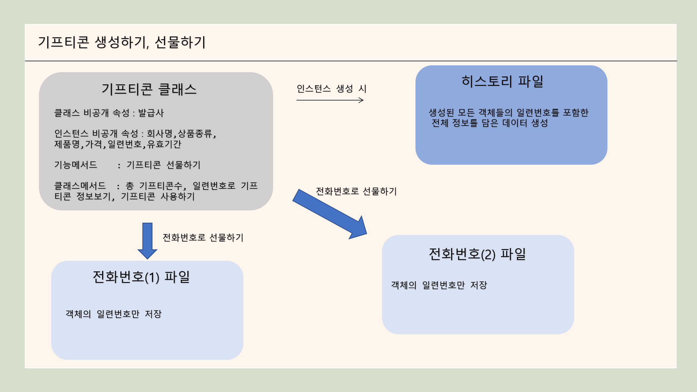

# 🚩 1주차 개인 프로젝트
-  기프티콘 생성/선물/사용하기 파이썬 터미널 서비스
----------------------------------------------------------

## 🖥️ 프로젝트 소개
- 카카오톡 기프티콘을 참고하여 만든 기프티콘 활용 서비스
 

----------------------------------------------------------

## 🧑‍🤝‍🧑 맴버구성
- 이태형

----------------------------------------------------------
## ⏱ Project Duration

- **개발을 위한 공부:** 2023.06.19. ~ 2023.07.07.
- **실제 개발 기간:** 2023.07.05. ~ 2023.07.07.
----------------------------------------------------------

## ⚙️ 개발 환경
- **Programming** : `Python 3.9`

----------------------------------------------------------

## 📌 주요 기능
#### 기프티콘 생성

#### 기프티콘 선물

#### 기프티콘 사용

----------------------------------------------------------

## 📓 STACKS
