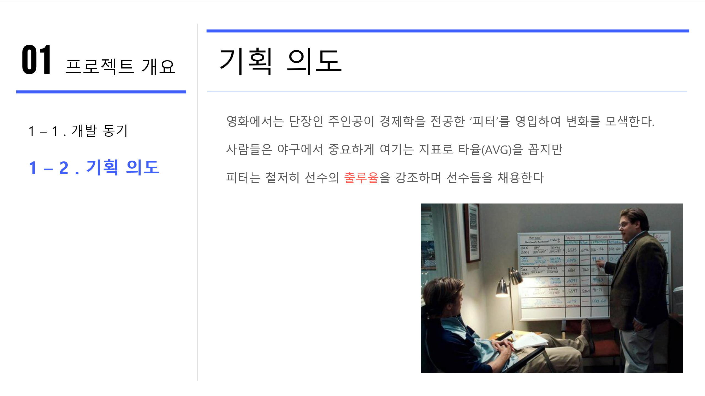
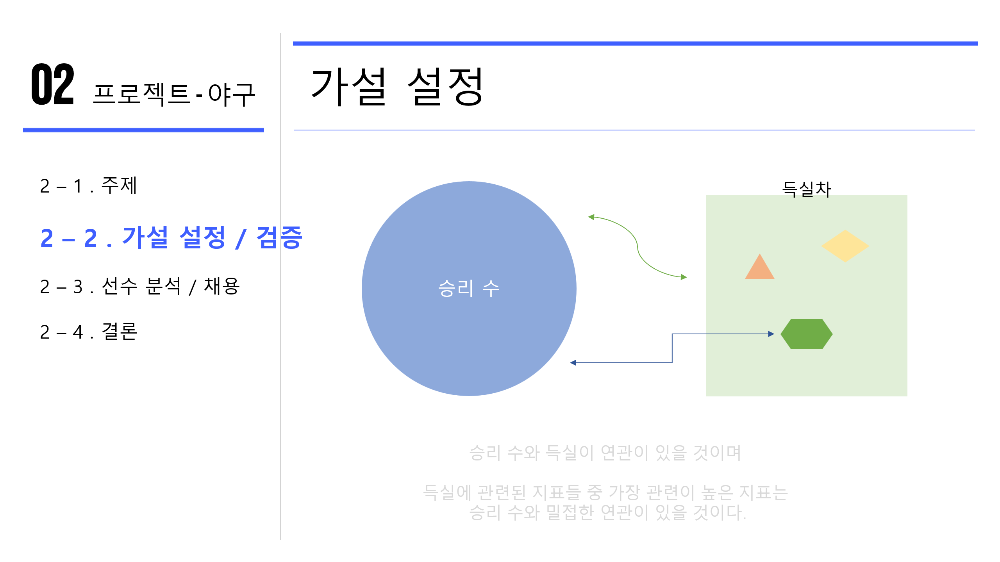
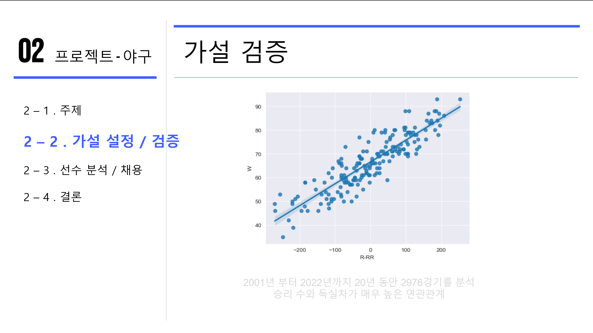
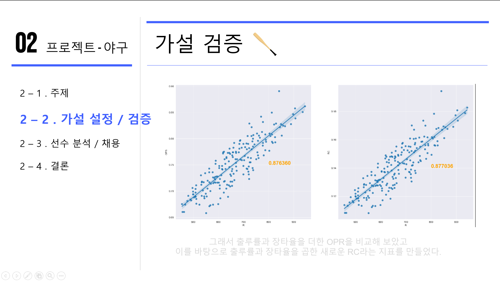
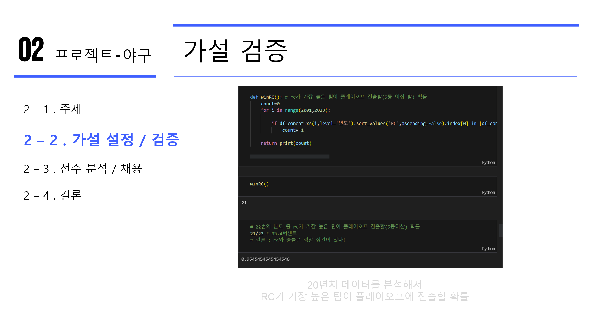
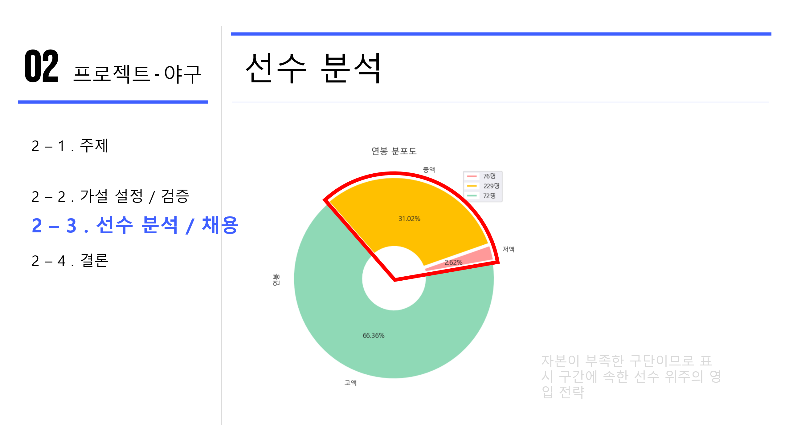
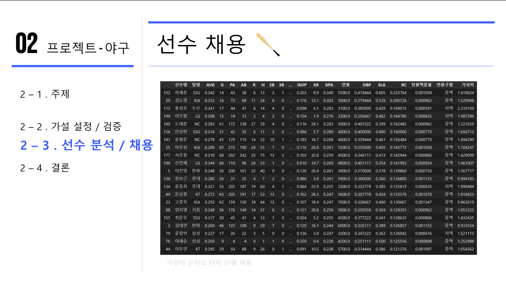
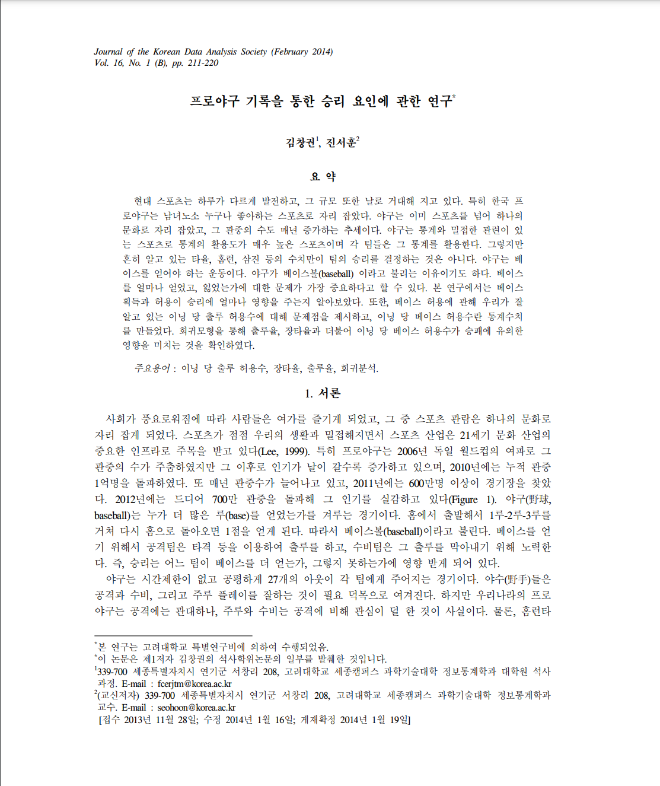

# 🚩 2주차 팀 프로젝트
# <strong>⚾ 머니볼</strong>
----------------------------------------------------------

## 🖥️ 프로젝트 소개
-  여러 스포츠에서 <mark style="background-color: #FFB0C9; color: #FFFFFF;">승리</mark>와 가장 관련이 있는 <mark style="background-color: #FFB0C9; color: #FFFFFF;">지표</mark>가 어떤 것이 있는지 데이터를 통해 분석

----------------------------------------------------------

### 🧑‍🤝‍🧑 맴버구성
 - 이태형, 이재필 : 야구와 관련된 지표들에서 <strong>새로운 지표</strong>를 도출해 <strong>플레이오프 진출 확률</strong>을 분석

 - 박윤미, 윤성원 : 농구의 팀 분석과 선수 지표 분석을 통한 최하위팀을 상위권으로 올리기 위해서 실력에 비해 연봉이 높은 선수를 방출, <strong>팀 리빌딩</strong>을 시도

----------------------------------------------------------

### ⚙️ 개발 환경
- **Programming** : `Python 3.9`
- **Framework** : `pandas 2.1.0` `matplotlib 3.7.2` `seaborn 0.12.2`
----------------------------------------------------------

## 📌 주요 내용

----------------------------------------------------------
## 📃 참고 논문
- KCI_FI001851296.pdf

----------------------------------------------------------
## 📓 STACKS
 
