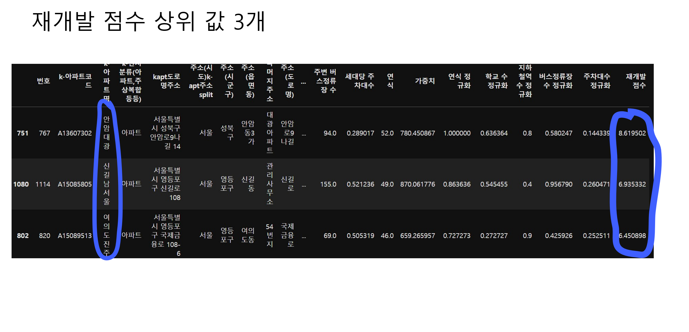

# 🚩 5주차 팀 프로젝트
# **소식가들**
----------------------------------------------------------

## 🖥️ 프로젝트 소개
-  서울 지역 **재개발 예상 아파트** 분석
- 10년간 아파트 매매 실거래 변화율을 분석해 실거래 변화율이 가장 높은 지역을 선택
- **주거 환경 기준**에 따른 안전진단 분석을 통해 데이터에서 **특정 변수**를 활용해 재개발 가능성이 높은 아파트를 식별하는 [**함수**]() 구현
- 함수를 사용하여 재개발 가능성이 높은 아파트 3개를 선정한 후, 해당 아파트가 **실제로 재개발 가능성**이 있는지 확인하기 위해 아파트 가격과 주변 신축 아파트 가격을 비교 분석
----------------------------------------------------------

## 🧑‍🤝‍🧑 맴버구성

| 이름  | 작업 영역 | 주요 작업 목록 |
|----|---|---|
| 이태형  | 데이터준비, 데이터분석 | pandas 라이브러리를 활용한 데이터 병합 및 전처리 작업,  결측치 임의 처리, 데이터의 전반적인 분석, 수식 등 구현, 지도 시각화 처리 등등| 
| 이승수  | 데이터준비, 데이터분석 | pandas 라이브러리를 활용한 데이터 병합 및 전처리 작업,  결측치 임의 처리,좌표 거리 계산 작업 및 데이터 정렬 | 
| 정세윤  | 데이터 분석, 시각화 | pandas, matplotlib 라이브러리를 활용한 자료 시각화 및 데이터 일괄 시각화 함수 구현,  미래 필요한 함수, 시각화 함수 구축 |
| 배진호  | 데이터 분석,시각화 | pandas 라이브러리 활용한 데이터(값) 분석,  간략 시각화 함수 구현 및 좌표 계산 오류 및 시간 복잡도 수정, GUI 구현 |

----------------------------------------------------------

## 📂데이터 수집
- KOSIS 국가통계포털 
- 공공데이터포털
- 서울 열린데이터광장

----------------------------------------------------------
## ⏱ Project Duration

- **개발을 위한 공부:** 2023.08.07. ~ 2023.08.11.
- **실제 개발 기간:** 2023.08.09. ~ 2023.08.11.
----------------------------------------------------------

## ⚙️ 개발 환경
- **Programming** : `Python 3.9`
- **Framework** : `pandas 2.1.0` `matplotlib 3.7.2` `seaborn 0.12.2` `folium 0.14.0`  `geopy 2.4.0` `numpy 1.24.3`

----------------------------------------------------------
## 📃 참고 논문
- 국토안전관리원 : 재건축사업의 안전진단 매뉴얼

----------------------------------------------------------
## 📌 주요 내용

----------------------------------------------------------
## ⌛ 문제 발생 / 해결

----------------------------------------------------------
## 📓 STACKS
      
