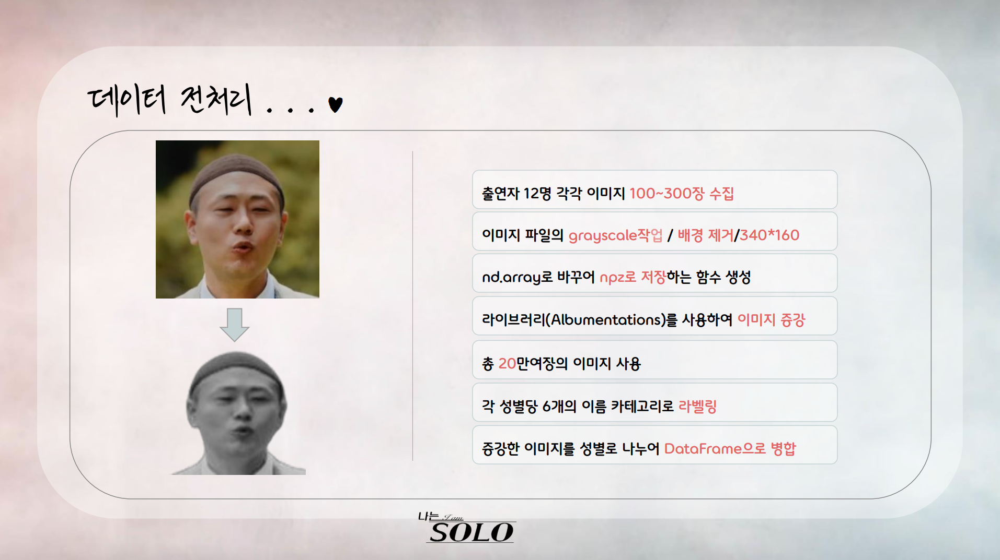
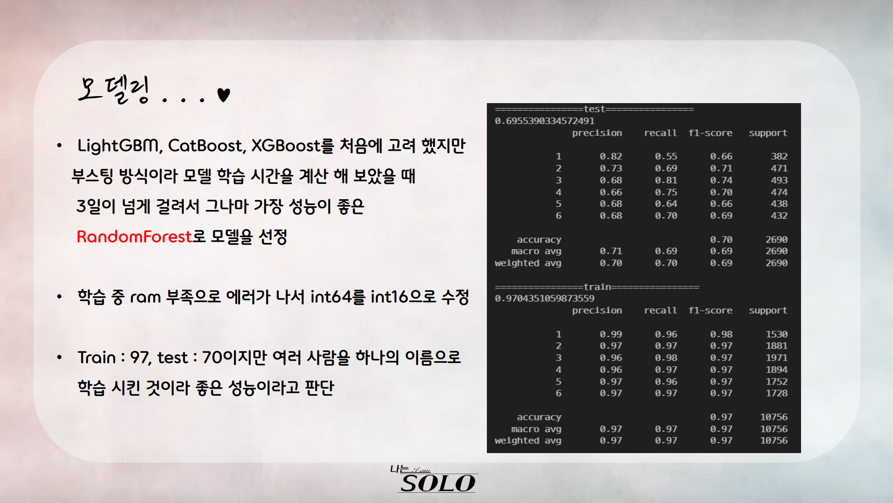
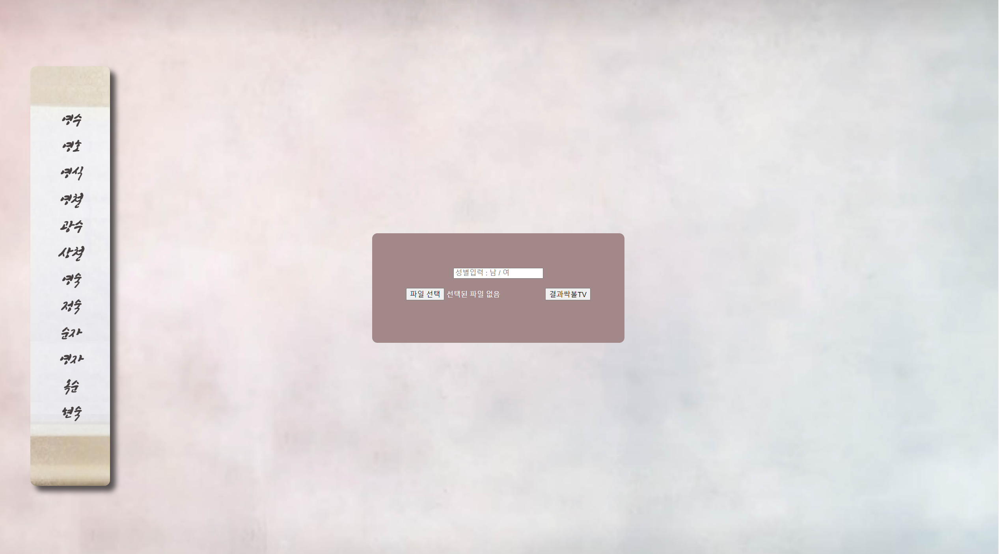
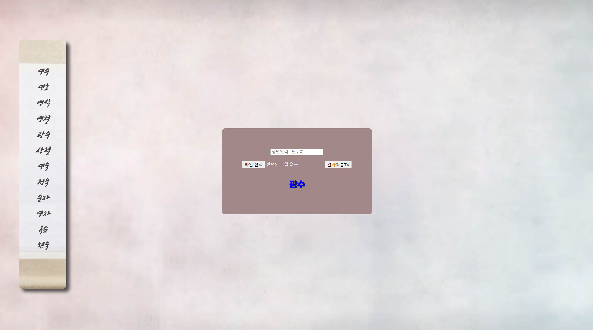
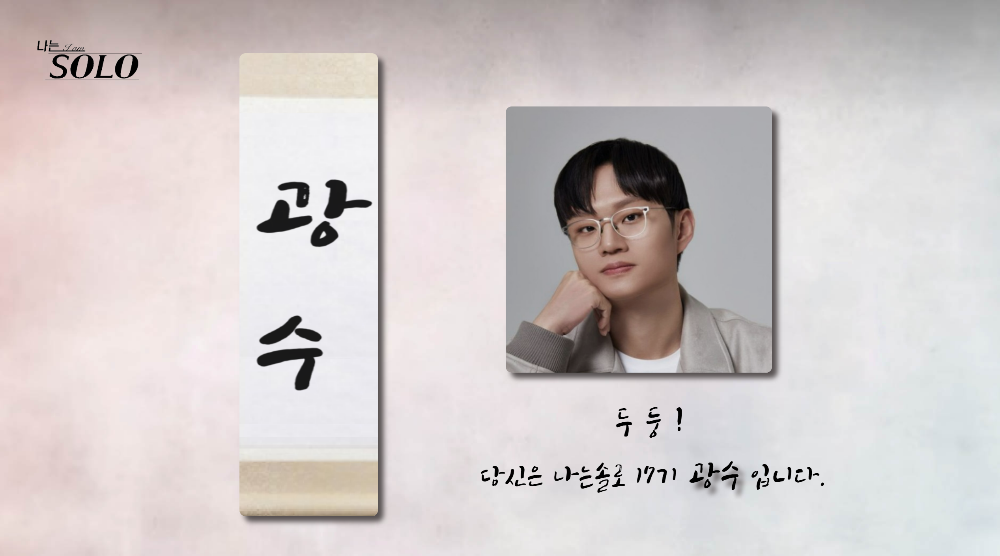
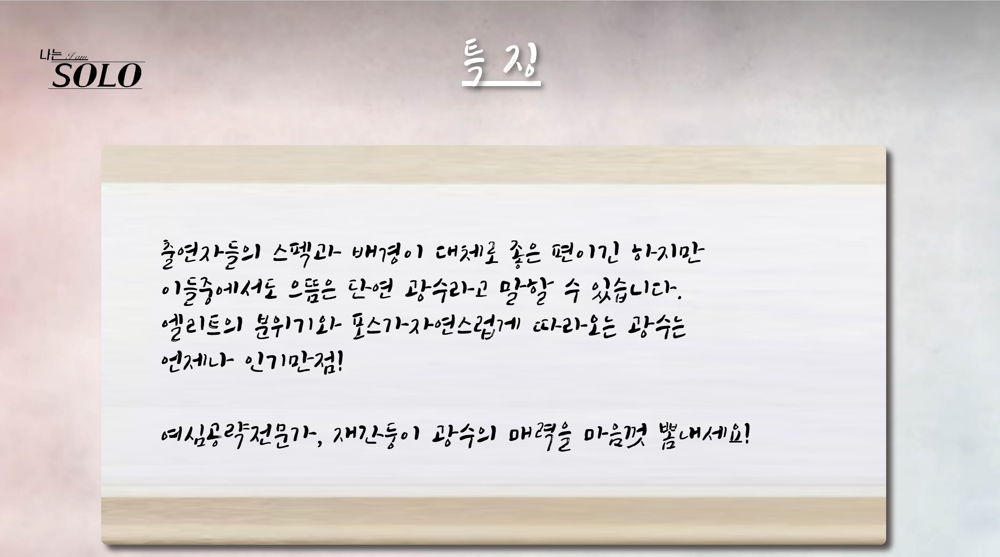
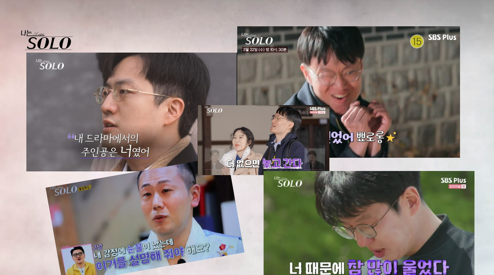

# 🚩 7주차 팀 프로젝트
# **Thirty, thirsty for love**
----------------------------------------------------------

## 🖥️ 프로젝트 소개
### '나는 솔로'
- 결혼을 간절히 원하는 12명의 솔로남녀들이 모여 사랑을 찾기 위해 고군분투하는 극사실주의  데이팅프로그램
- 각 출연자는 외모와 분위기에 따라 제작진이 정해준 ‘**이름**’을 받음
### 내가 '나는 솔로'에 출연한다면?
- 사용자의 사진을 넣으면 그 사진의 이미지을 분석하여 어울리는 ‘이름’을 찾아주고 ‘이름’이 어떤 사람인지 글과 사진을 통해 설명하는 페이지를 제작

----------------------------------------------------------

## 🧑‍🤝‍🧑 맴버구성

| 이름 | 작업 영역 | 주요 작업 목록 |
|---|---|---|
| 이태형  | 데이터 전처리, 모델링, 웹페이지 구성, 서버구축 | albumentations 라이브러리를 활용한 데이터 증강, randomForestclassification  모델 구축, cgi 라이브러리로 웹 서버 구축, 메인페이지 디자인 설계 
| 배보람  | 데이터 수집 및 정제, 웹페이지 구성 | cv2, glob 라이브러리를 활용한 이미지 비율 설정, 웹페이지 서브 페이지  디자인 설계 | 
| 허유나  | 데이터 수집 및 정제, 웹페이지 구성 | cv2, glob 라이브러리를 활용한 이미지 비율 설정, 웹페이지 서브 페이지  디자인 설계 |
| 최성진  | 데이터 수집 및 정제, 이미지 데이터 전처리 | cv2, glob 라이브러리를 활용한 이미지 비율 설정, albumentations  라이브러리를 활용한 데이터 증강 |

----------------------------------------------------------

## 📂데이터
- 이미지 크롤링
- 데이터 증강 후 남성 출연자 이미지 13446장, 여성 출연자 이미지 7896장 학습 
----------------------------------------------------------

## ⚙️ 개발 환경
- **Programming** : `Python 3.9`
- **Framework** : `pandas 2.1.0` `matplotlib 3.7.2` `seaborn 0.12.2`  `numpy 1.24.3` `sklearn 1.3.2` `opencv-python 4.6.0.66`

----------------------------------------------------------
## 📌 주요 내용

## 💻 웹페이지
- 메인 페이지

- 결과 확인창

- 서브 페이지

----------------------------------------------------------
## 📓 STACKS
        

