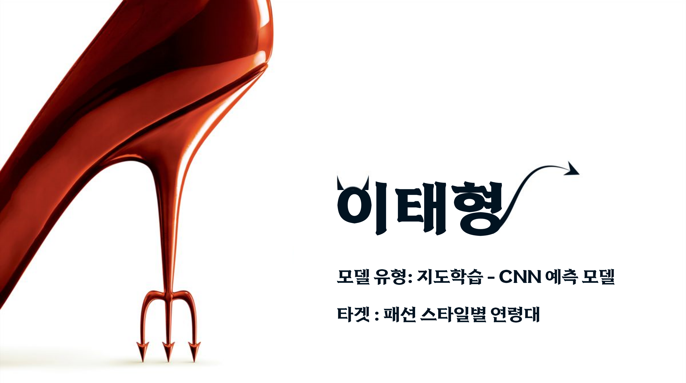
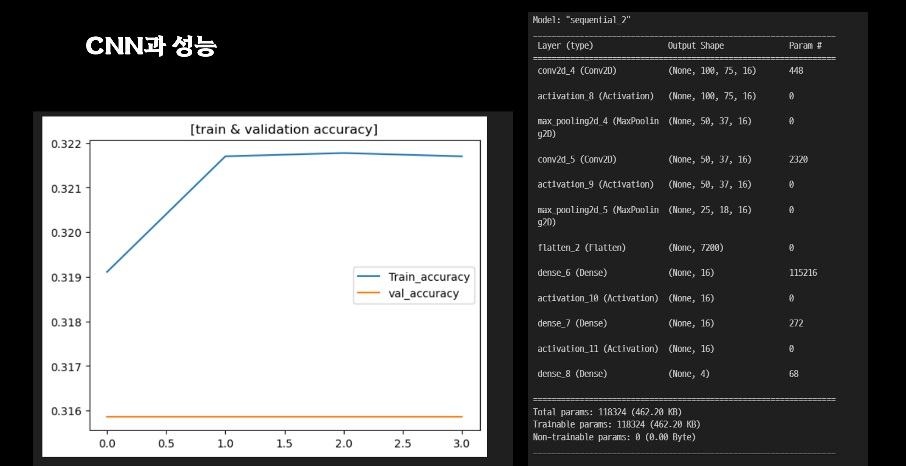
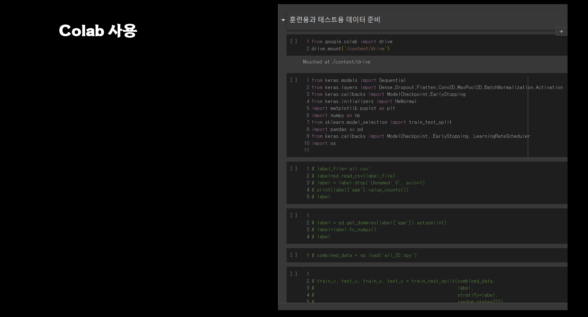
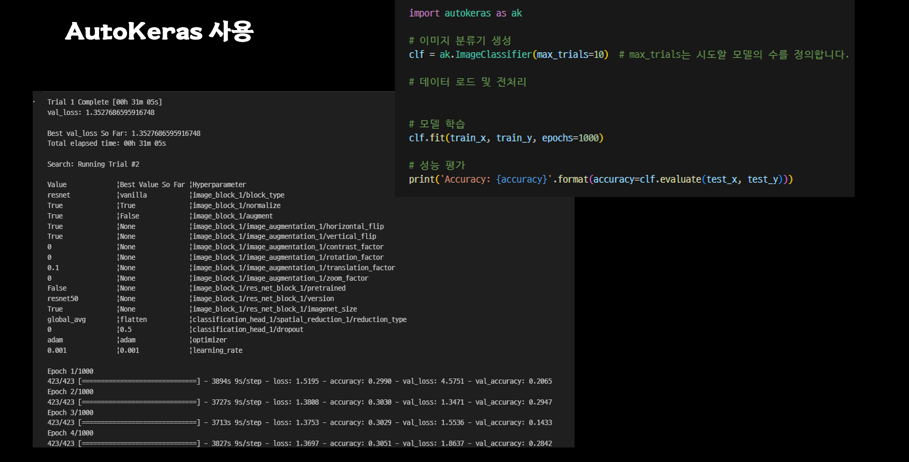

# 🚩 8주차 팀 프로젝트
# **THE DEVIL WEARS KERAS**
----------------------------------------------------------

## 🖥️ 프로젝트 소개
- 나는 어떤 스타일로 옷을 입고 있을까요? 전신 사진을 업로드하면, 나의 스타일을 분석해 줍니다.
   - 사용자로부터 입력받은 이미지에 대해 아래 5가지 항목에 대한 분류 예측
     1.   시   대   :  1950 / 1960 / 1970 / 1980 / 1990 / 2000 / 2010 / 2020
     2.  연 령 대  :  20대 / 30대 / 40대 / 50대 
     3.  스 타 일  : 히피룩, 페미닌룩, 힙합룩 등 23개 스타일
     4.  직 업 군  : 가정주부, 학생, 전문직 등 6개 직업군
     5. 소득수준 :  200만원 미만 ~ 600만원 이상 6 구간 분류

   - 각 항목의 개별 CNN 모델 생성

  

- 다섯개의 모델을 활용해 스타일 분석 웹 서비스 구현

----------------------------------------------------------

## 🧑‍🤝‍🧑 맴버구성

----------------------------------------------------------

## 📂데이터
- AI 허브의 연도별 패션 선호도 파악 및 추천 데이터
----------------------------------------------------------

## ⚙️ 개발 환경
- **web** : `flask 2.3.3`
- **Programming** : `Python 3.9`
- **Framework** : `pandas 2.1.0`  `numpy 1.24.3` `opencv-python 4.6.0.66` `keras 2.13.1`

----------------------------------------------------------
## 📌 주요 내용

## 💻 웹페이지
- 메인 페이지

- 결과 확인창

----------------------------------------------------------
## 📓 STACKS
          

