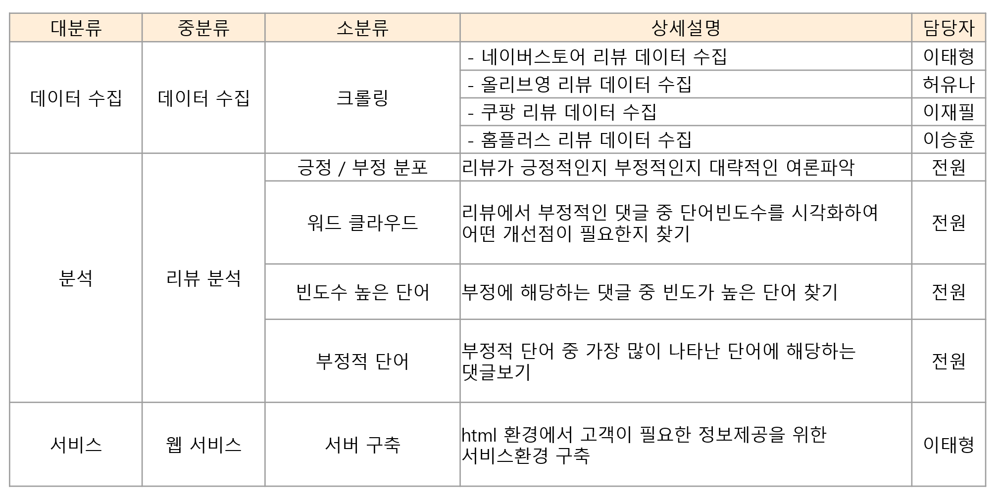
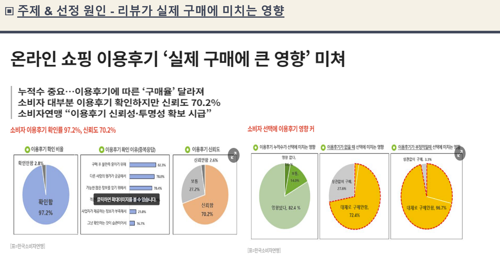
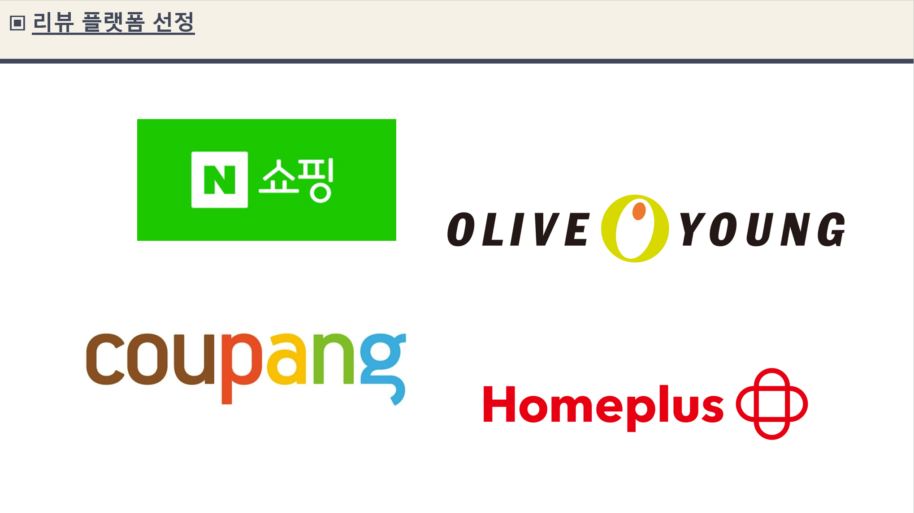
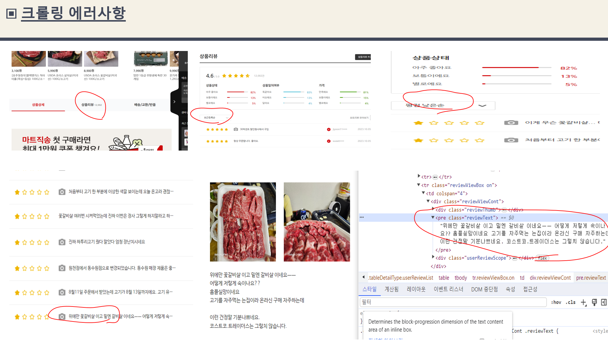
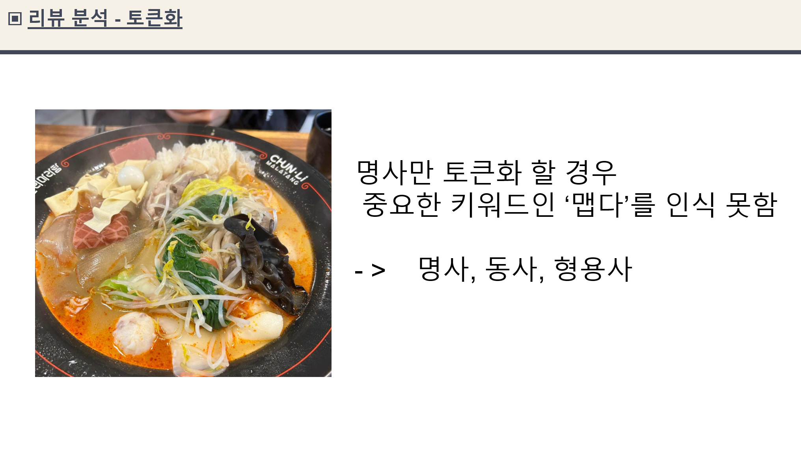
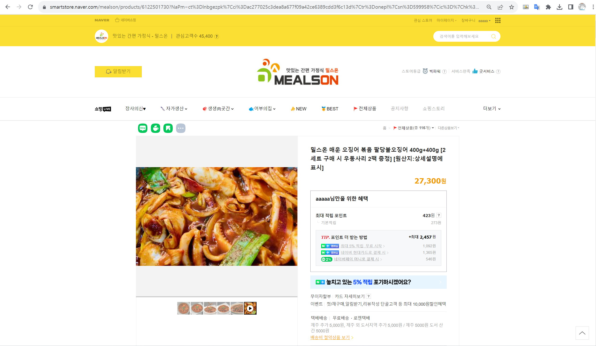
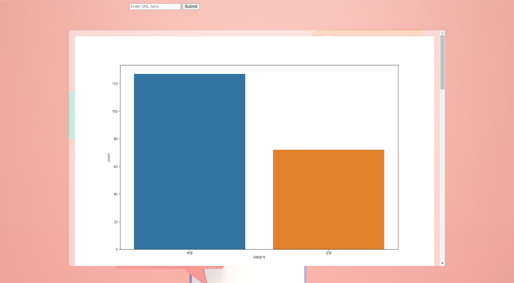
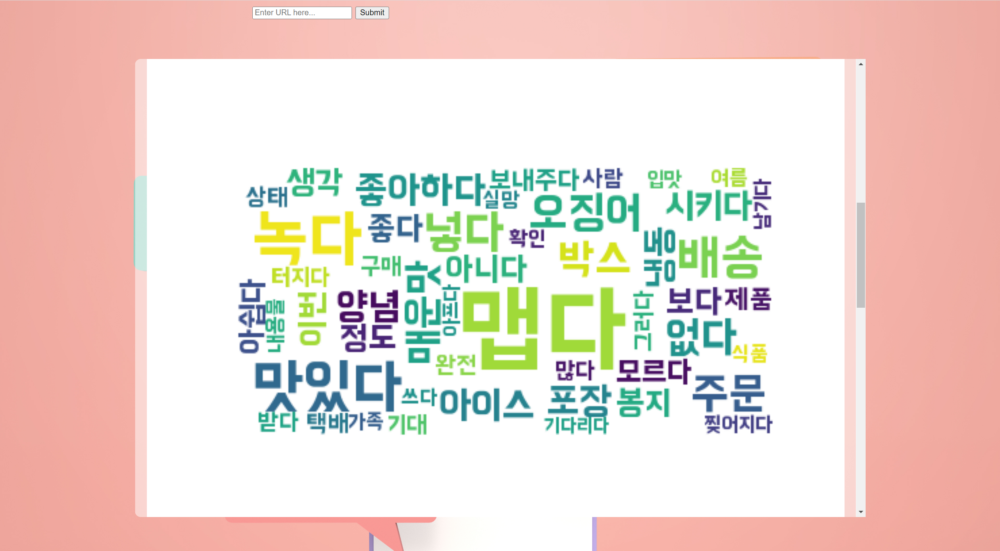
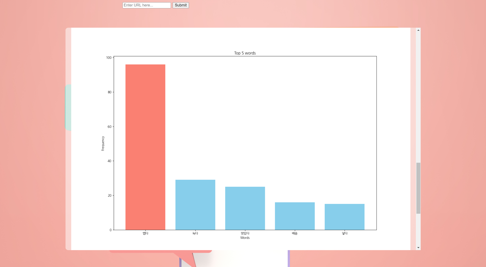
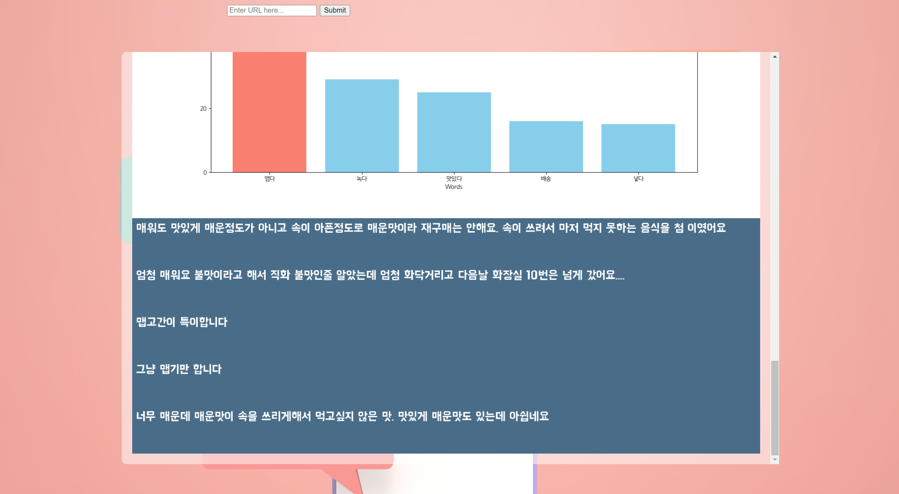

# 🚩 9주차 팀 프로젝트
# **리뷰 분석 서비스**
----------------------------------------------------------

## 🖥️ 프로젝트 소개
- 판매 제품의 리뷰를 분석해 **감성분석**과 **시각화**를 통하여 개선해야 할 점을 찾는 서비스
- 네이버스토리, 올리브영, 쿠팡, 홈플러스 제품 url을 넣으면 **실시간**으로 리뷰를 크롤링 해서 분석과 결과를 도출
- 감성분석은 더 정확한 결과를 위해 감성사전을 이용하지 않고 **openai**를 사용해 분석

----------------------------------------------------------

## 🧑‍🤝‍🧑 맴버구성

----------------------------------------------------------

## ⏱ Project Duration

- **개발을 위한 공부:** 2023.10.02. ~ 2023.10.06.
- **실제 개발 기간:** 2023.10.05. ~ 2023.10.06.

----------------------------------------------------------
## ⚙️ 개발 환경
- **web** : `flask 2.3.3`
- **Programming** : `Python 3.9`
- **Framework** : `beautifulsoup4 4.12.2` `selenium 4.12.0` `konlpy 0.6.0` `openai 0.28.0` `sklearn 1.3.2` `wordcloud 1.9.2`

----------------------------------------------------------
## 📌 주요 내용

## 💻 웹페이지
- 메인 페이지
  

  
- 리뷰 분석 하고 싶은 제품 **url** 입력하기
  

  
- 결과 확인창
  

----------------------------------------------------------
## 📓 STACKS
            

