# 🚩 10주차 팀 프로젝트
# **Enjoy Your Travel**
----------------------------------------------------------

## 🖥️ 프로젝트 소개
- 특정 지역에서 이용자가 현재 원하는 키워드를 바탕으로 유사도를 분석해 주변 관광지를 추천하는 서비스
- 정보가 부족한 외래 관광객들에게 쉽게 이용할 수 있는 접근성을 제공합니다

----------------------------------------------------------

## 🧑‍🤝‍🧑 맴버구성
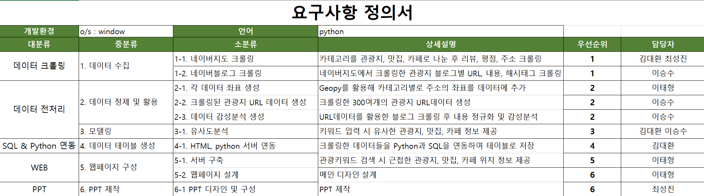

----------------------------------------------------------

## 📂데이터
- 네이버 지도, 네이버 블로그
----------------------------------------------------------
## ⏱ Project Duration

- **개발을 위한 공부:** 2023.10.02. ~ 2023.10.13.
- **실제 개발 기간:** 2023.10.12. ~ 2023.10.13.
----------------------------------------------------------
## ⚙️ 개발 환경
- **Web** : `flask 2.3.3`
- **Database** : `mariadb 1.1.7`
- **Programming** : `Python 3.9`
- **Framework** : `pandas 2.1.0`  `numpy 1.24.3` `geopy 2.4.0` `folium 0.14.0` `konlpy 0.6.0` `sklearn 1.3.2` `selenium 4.12.0`

----------------------------------------------------------
## 📌 주요 내용
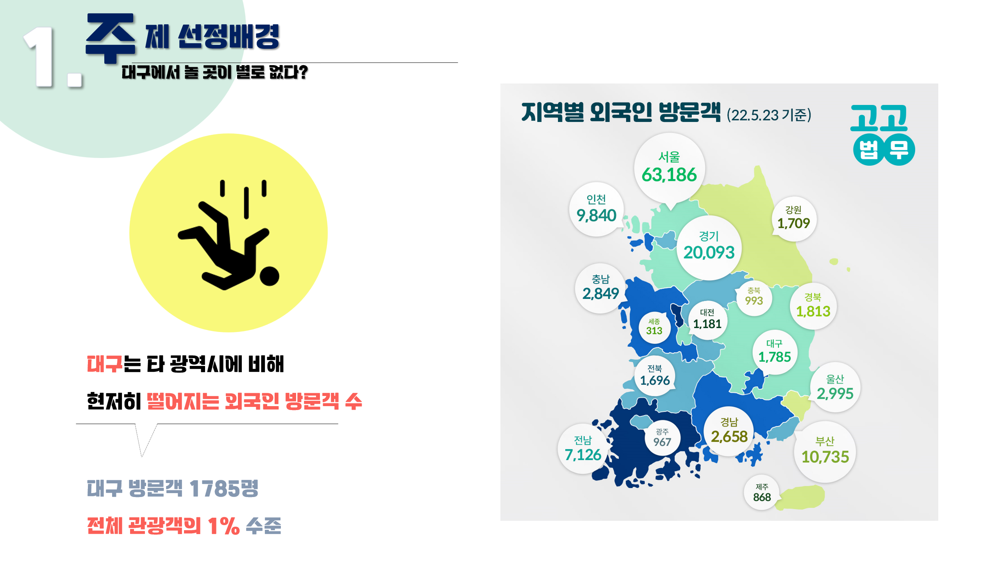
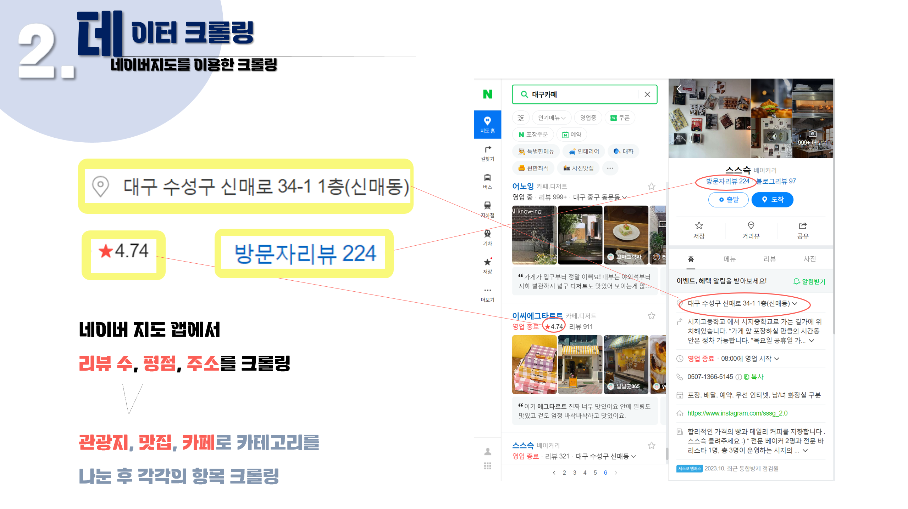
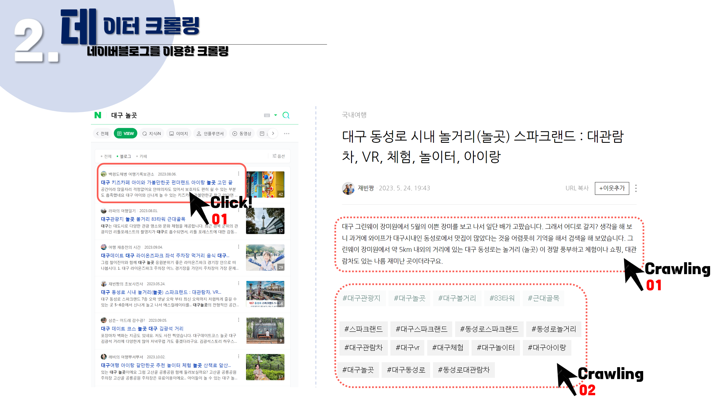
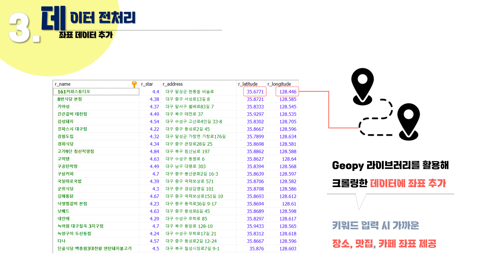
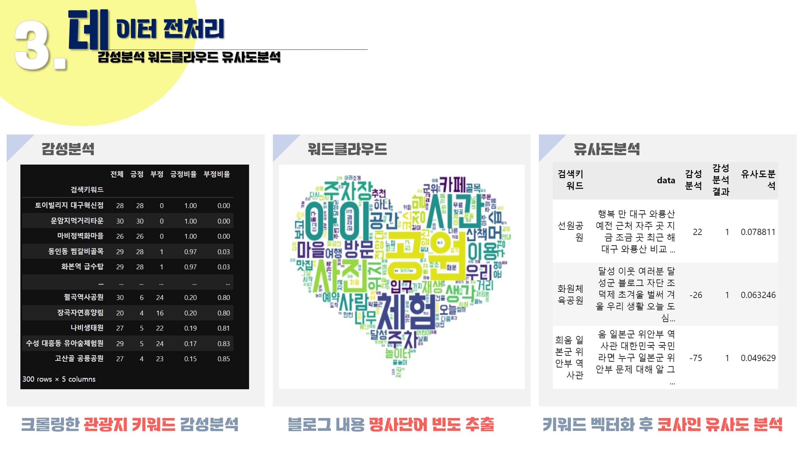
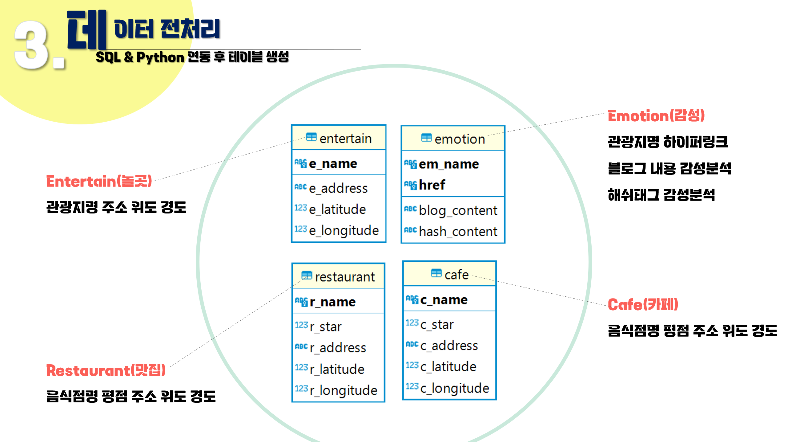
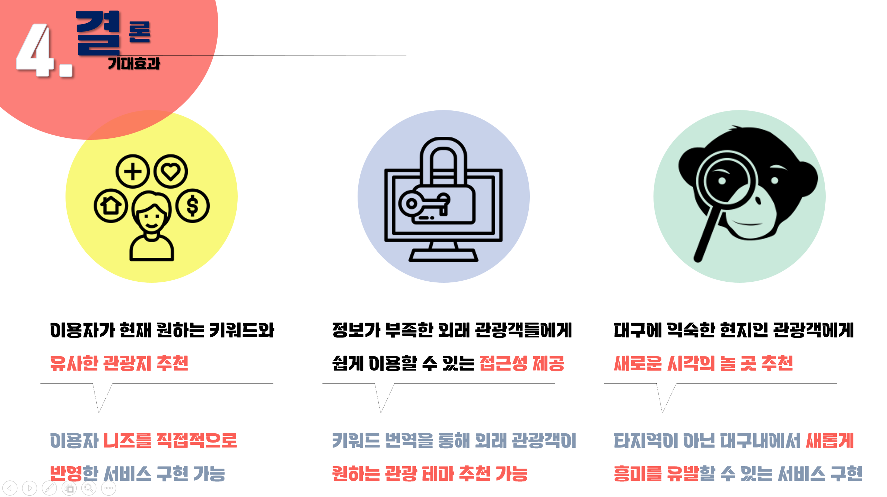
## 💻 웹페이지
- 메인 페이지
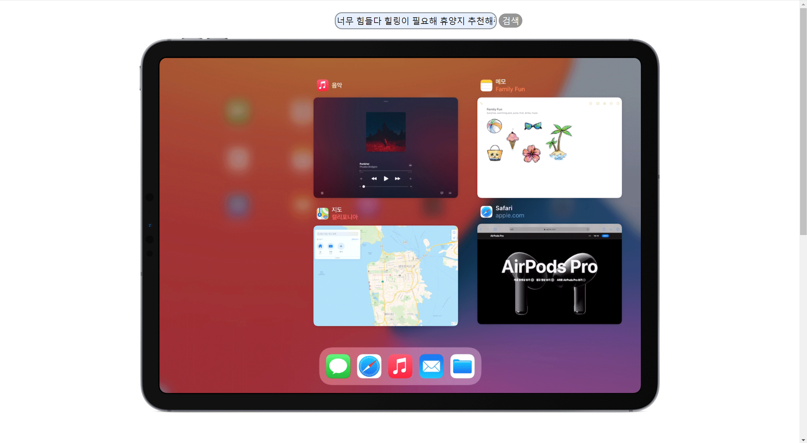
- 결과 확인창
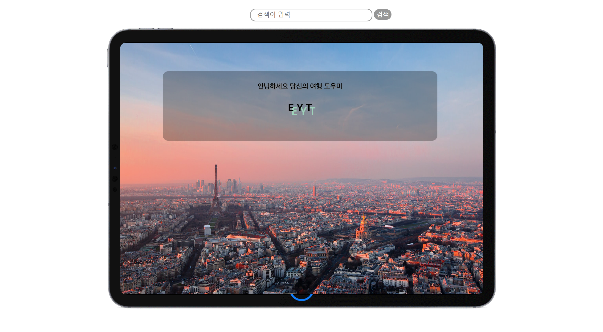

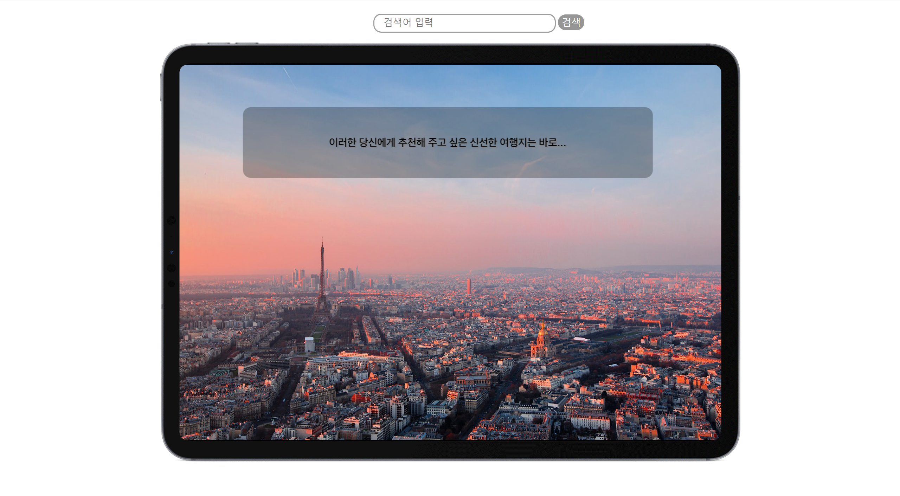
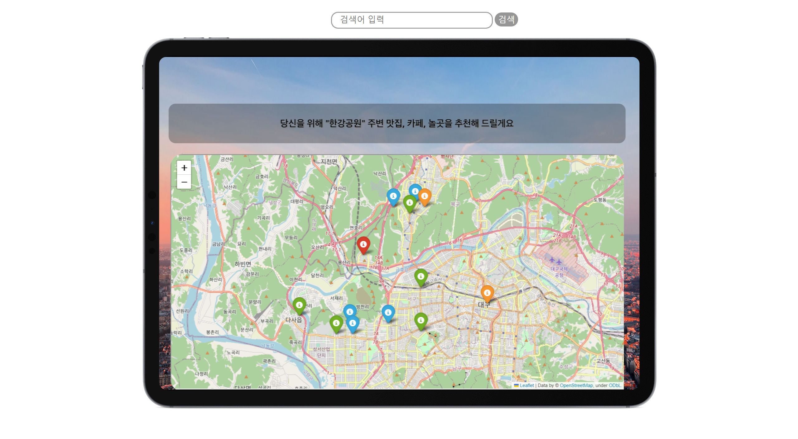
----------------------------------------------------------
## 📓 STACKS
            

