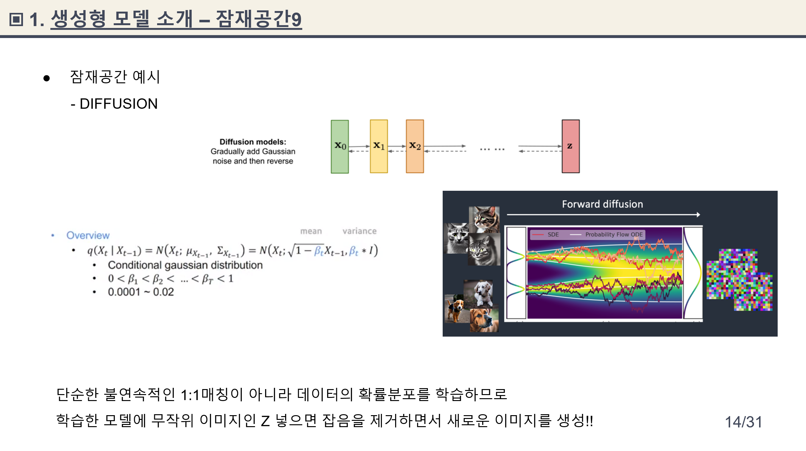

# 🚩 11주차 개인 프로젝트 
# **이미지 생성형 AI 활용 서비스**
----------------------------------------------------------

## 📝 Index
- [프로젝트 소개](#🖥️-프로젝트-소개) 
- [데이터](#📂데이터)
- [개발 환경](#⚙️-개발-환경)
- [주요 내용](#📌-주요-내용)
    - 사전 학습 내용
    - 새로운 포켓몬 생성 ai 모델
    - 이미지 합성 생성 ai 모델
    - 가상인물 생성 ai 모델
- [웹페이지](#💻-웹페이지)
- [STACKS](#📓-stacks)

----------------------------------------------------------
## 🖥️ 프로젝트 소개
- 제 멋지고 늠름한 프로젝트를 소개함무라비법전~~~! 🌠
- 포켓몬 사진을 학습시켜서, 포켓몬 반숙 후라이를 구워줌인줌아웃! 개존맛탱구리! 👍👍
- 사람 사진을 넣으면 외국인으로 형변환해줌! 대존예승이콩먹어콩! 🫦🫦
- 특정 지역에서 이용자가 현재 원하는 키워드를 바탕으로 유사도를 분석해 주변 관광지를 추천하는 서비스타벅스
- 정보가 부족한 외래 관광객들에게 쉽게 이용할 수 있는 접근성을 제공합니다람쥐 KIN 

----------------------------------------------------------

## 📂데이터
- 포켓몬 898종의 각 3~4장 총 2503장의 이미지 데이터 : https://www.kaggle.com/datasets/hlrhegemony/pokemon-image-dataset 
- 인물사진 약 20만장
 : https://www.kaggle.com/datasets/jessicali9530/celeba-dataset
----------------------------------------------------------

## ⚙️ 개발 환경
- **Web** : `flask 2.3.3`
- **Programming** : `Python 3.9`
- **Framework** : `keras 2.13.1` `tensorflow 2.13.0`

----------------------------------------------------------
## 📌 주요 내용
- 사전 학습 내용
      

- 새로운 포켓몬 생성 ai 모델
      

- 이미지 합성 생성 ai 모델
      

- 가상인물 생성 ai 모델
      

## 💻 웹페이지
- 웹페이지 구성
      

- 메인 페이지
      

- 결과 확인창
      

----------------------------------------------------------
## 📓 STACKS
              

