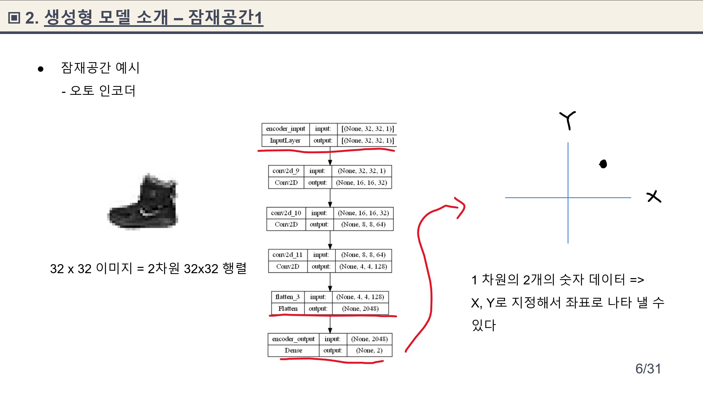
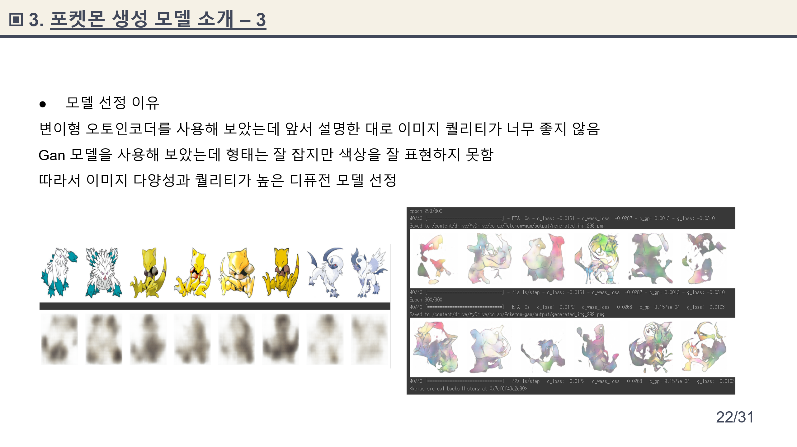

# 🚩 11주차 개인 프로젝트 
# **이미지 생성형 AI 활용 서비스**
----------------------------------------------------------

## 📝 Index
- [프로젝트 소개](#🖥️-프로젝트-소개) 
- [데이터](#📂데이터)
- [Project Duration](#⏱-project-duration)
- [개발 환경](#⚙️-개발-환경)
- [주요 내용](#📌-주요-내용)
    - 사전 학습 내용
    - 새로운 포켓몬 생성 ai 모델
    - 이미지 합성 생성 ai 모델
    - 가상인물 생성 ai 모델
- [웹페이지](#💻-웹페이지)
- [STACKS](#📓-stacks)

----------------------------------------------------------
## 🖥️ 프로젝트 소개
- 생성형 이미지 ai를 활용하여 어떠한 서비스들을 만들어 낼 수 있는지 알아보고 데이터를 이용해 서비스를 구현하였습니다.
- 프로젝트를 진행하기 앞서 생성형 모델들에 대해서 공부를 해 각 모델의 장단점을 알아 보았습니다.

----------------------------------------------------------

## 📂데이터
- 포켓몬 898종의 각 3~4장 총 2503장의 이미지 데이터 : https://www.kaggle.com/datasets/hlrhegemony/pokemon-image-dataset 
- 인물사진 약 20만장
 : https://www.kaggle.com/datasets/jessicali9530/celeba-dataset

----------------------------------------------------------
## ⏱ Project Duration

- **개발을 위한 공부:** 2023.10.16. ~ 2023.10.26.
- **실제 개발 기간:** 2023.10.20. ~ 2023.10.26.
----------------------------------------------------------
## ⚙️ 개발 환경
- **Web** : `flask 2.3.3`
- **Programming** : `Python 3.9`
- **Framework** : `keras 2.13.1` `tensorflow 2.13.0`

----------------------------------------------------------
## 📌 주요 내용
- 사전 학습 내용
      

- 새로운 포켓몬 생성 ai 모델
      

- 이미지 합성 생성 ai 모델
      

- 가상인물 생성 ai 모델
      

## 💻 웹페이지
- 웹페이지 구성
      

- 메인 페이지
      

- 결과 확인창
      

----------------------------------------------------------
## 📓 STACKS
              

